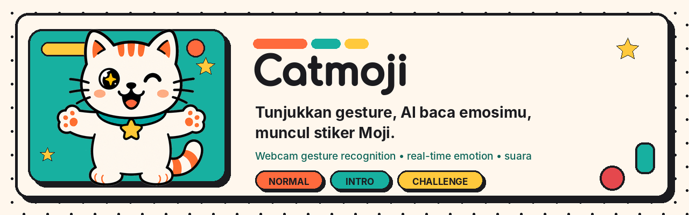
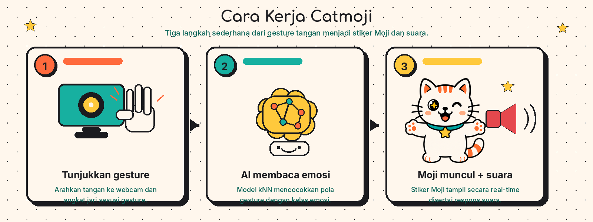

# Catmoji

<p align="center">
  
</p>

Catmoji mengubah gesture tangan menjadi emosi, lalu menampilkan stiker kucing Moji dan respons suara secara real-time. Ini adalah eksperimen computer vision interaktif yang dibangun untuk web.

## Cara Kerja



1. Arahkan tangan ke webcam dan tunjukkan jumlah jari.
2. MediaPipe membaca landmark tangan, lalu classifier kNN mencocokkan pola gesture ke emosi.
3. Moji muncul dengan stiker dan respons suara sesuai emosi yang terdeteksi.

## Fitur

- Lima emosi gesture: happy, sad, angry, surprised, dan excited.
- Mode Normal untuk bermain bebas, Intro untuk perkenalan interaktif, serta Challenge dengan tiga nyawa.
- Face-first Intro: owner dikenali lebih dulu, sementara pengguna lain dapat mengisi data intro untuk sesi aktif.
- Gemini TTS saat proxy tersedia, dengan Web Speech API sebagai fallback.
- PWA installable dengan icon maskable, favicon baru, dan offline shell cache.
- Data form intro tidak dikirim atau disimpan sebagai profil pengguna.

## Stack

- Vanilla HTML, CSS, dan JavaScript
- MediaPipe Hands untuk hand landmarks
- kNN distance-weighted, 2,460 sample training, `K=7`, smoothing 7 frame
- `@vladmandic/human` untuk Face-ID owner
- Gemini TTS melalui Vercel serverless function
- Vercel untuk deployment

## Jalankan Lokal

```bash
node dev-server.js
```

Buka `http://localhost:8000`. Server lokal ini juga menjalankan proxy TTS bila `.env` berisi konfigurasi Gemini. Untuk preview UI tanpa meminta kamera, buka `http://localhost:8000/?nocam`.

## Struktur Penting

```text
assets/
  brand/       # logo, favicon master, PWA, social preview, OG image
  readme/      # hero dan diagram dokumentasi
  stickers/    # ekspresi dan pose Moji
  ui/          # state dan aksen antarmuka
  _originals/  # source archive lokal, tidak masuk Git
api/tts.js     # Gemini TTS proxy
face.js        # owner recognition dan enrollment
index.html     # aplikasi utama
manifest.webmanifest
sw.js
training/      # pipeline model dan data lokal
```

## Catatan PWA dan Share Preview

- PWA dapat di-install setelah website dibuka melalui HTTPS atau localhost. Cache offline menyimpan shell aplikasi; webcam, CDN model, dan Gemini TTS tetap memerlukan koneksi saat belum tersedia di cache.
- `og:image` dan `twitter:image` sudah memakai asset baru. Sebelum share ke publik, ganti nilainya menjadi URL absolut domain Vercel final.
- Upload `assets/brand/catmoji-github-social-preview.png` secara manual melalui GitHub repository Settings, bagian Social preview.

## License

Personal portfolio project by Henry Nugraha.
